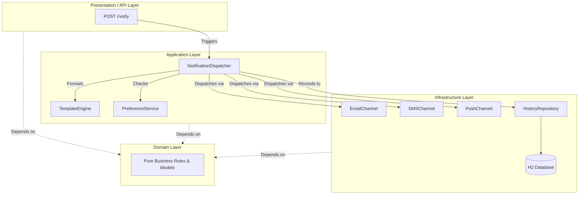

# Notification Dispatch System

An enterprise-grade engine for routing event-based notifications across multiple communication channels.


## Project Overview

This system acts as a central hub that delivers important alerts to users. Instead of hardcoding how a message is sent, the system automatically figures out whether a user prefers to be contacted via email, text message, or push notification. It ensures the right message reaches the right person on their preferred platform, even if the primary sending service temporarily goes down.

## Key Features

*   **Multi-Channel Routing:** Dynamically dispatches messages through parallel plugins for Email, SMS, and Push notifications.
*   **Preference-Aware Dispatch:** Resolves individual user settings to ensure notifications are only routed to opted-in communication channels.
*   **Fault-Tolerant Retry Policies:** Utilizes an Exponential Backoff strategy to handle transient network or API failures gracefully without dropping messages.
*   **Dynamic Template Engine:** Generates contextual message bodies and assigns priority levels on the fly based on the specific event trigger.
*   **Dispatch History Persistence:** Maintains a permanent, queryable audit log of all attempted notifications, recording successes and specific error messages.

## Architecture

This project is built using **Hexagonal Architecture** (also known as Ports and Adapters). The core rule of this architecture is that business logic should not depend on technical implementation details. The application is built in concentric rings: the inner layers contain pure business rules, while the outer layers plug into it to handle databases, web requests, and external APIs. This makes the core logic completely portable, testable, and insulated from framework changes.

```text
src/main/java/com/notificationsystem
├── domain          # Core business models (User, Notification, Enums) with zero dependencies
├── application     # Use cases (Dispatcher, Templates, Retry Policies)
├── infrastructure  # Driven adapters (H2 Database repositories, external Channels)
├── api             # Driving adapters (REST Controllers)
└── config          # Spring wiring and application setup
```

### Architecture Diagram



## How to Run

1. Clone the repository to your local machine.
2. Ensure you have Java and Maven installed.
3. Start the application by running `mvn spring-boot:run` in your terminal.
4. Access the Swagger UI documentation at `http://localhost:8080/swagger-ui/index.html`.

## API Endpoints

| Method | Endpoint | Description |
| :--- | :--- | :--- |
| `POST` | `/users` | Creates a new user with contact details and notification channel preferences. |
| `POST` | `/notify` | Triggers a notification event for a specific user based on an event type. |
| `GET` | `/history` | Returns the complete audit log of all dispatched notification attempts. |

## Design Decisions

**Why Hexagonal Architecture?**
By enforcing strict boundaries between the domain and the infrastructure, the core application logic is completely shielded from external dependencies. If the underlying database changes from H2 to PostgreSQL, or if the SMS provider switches from Twilio to AWS SNS, the core domain and application layers do not require a single line of code to be modified.

**Why composable retry policies?**
Hardcoding retry loops inside channel implementations violates the Single Responsibility Principle and makes testing difficult. By utilizing the Strategy Pattern to pass a `RetryPolicy` interface (like Exponential Backoff) directly into the dispatcher, the system can dynamically apply different fault-tolerance strategies based on the priority or type of the event without polluting the sending mechanisms.

**Why was preference-aware routing built as a separate service?**
Extracting user preference resolution into a dedicated `NotificationPreferenceService` prevents the `NotificationDispatcher` from becoming a bloated "god class". This isolation ensures that as preference logic becomes more complex—such as factoring in user timezones, subscription tiers, or specific event opt-outs—the routing engine itself remains untouched.
